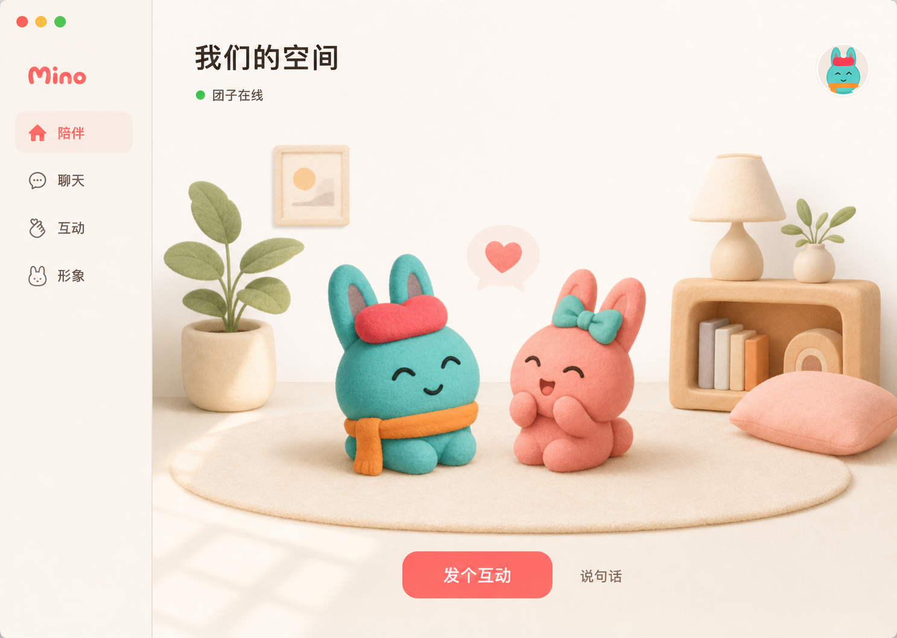

# Mino

原生 macOS 个人桌宠，住在菜单栏里，没有 Dock 图标。每个账号一只宠物。形象、养成和个人事件线跟着这个账号走，不是某段关系的装饰。

摸摸、投喂、陪玩、散步会马上有动画和状态。这些基础互动在本机完成，不调用模型。云端只保存身份、好友、养成和串门事实。网络用来同步这些事实，桌宠不必等网络返回才播放动画。

只有接受的好友才能邀请、登门、互动或托信。托出去的文字信是密封的，正文不进事件线、日志或模型上下文，只有授权的人能读。



## 安装

macOS 14+，Apple 芯片。不需要开发者账号：

```sh
curl -fsSL https://raw.githubusercontent.com/liyown/mino/main/Scripts/install.sh | zsh
```

脚本会下载 CI 的 [unsigned nightly](https://github.com/liyown/mino/releases/tag/nightly)，校验 SHA-256，装到 `~/Applications/Mino.app` 并启动。这是 ad-hoc 包，不是 Developer ID 签名。同一份 app 再打开会保留登录；换一个构建需要重新登录。

如果系统提示无法验证开发者，按住 Control 单击 `~/Applications/Mino.app`，再选打开。

指定某个正式 tag：

```sh
curl -fsSL https://raw.githubusercontent.com/liyown/mino/main/Scripts/install.sh | MINO_INSTALL_RELEASE=v0.1.0 zsh
```

nightly 只在 `main` 的测试和 release 都通过后更新。仓库还没有 [Release](https://github.com/liyown/mino/releases) 时，用下面的源码安装。

## 从源码安装

本地已经有仓库的话：

```sh
Scripts/install-app.sh --release --open
```

```sh
Scripts/install-app.sh --zip    # 额外打出 apps/macos/.build/Mino-unsigned.zip
```

有稳定的 Developer ID 时，release 包可以改用 Keychain，登录就能跨版本保留：

```sh
MINO_BUILD_CONFIGURATION=release \
MINO_CODE_SIGN_IDENTITY="Developer ID Application: …" \
Scripts/build-app.sh
```

标准客户端连生产服务 `https://api.mino.pet`。界面里没有服务器地址或超时设置。`MINO_API_BASE_URL` 只给本地双客户端和 smoke 用。

## 本地开发

macOS 14+、Swift 6.2+、Node.js 20+。后端跑在本机的 Cloudflare Workers Runtime，不需要 Docker 或 PostgreSQL。

```sh
cp apps/worker/.env.example apps/worker/.dev.vars
npm --prefix apps/worker ci
npm --prefix apps/worker run db:migrate:local
npm --prefix apps/worker run dev -- --ip 127.0.0.1 --port 8787
```

另一个终端里启动 Alice / Bob 两个隔离的 Debug 客户端：

```sh
MINO_API_BASE_URL=http://127.0.0.1:8787 Scripts/dev-dual-clients.sh
```

会生成 `apps/macos/.build/dual-clients/Mino-alice.app` 和 `Mino-bob.app`。

用 [mise](https://mise.jdx.dev/)：

```sh
mise install
mise test                  # 全仓库
mise //apps/macos:test
mise //apps/worker:dev
```

没有 mise 的话继续用 `Scripts/`。`Scripts/test.sh` 会跑 Swift 测试、Worker 检查、OpenAPI 生成和 Wrangler dry-run。

## 工作方式

```text
macOS 客户端 ── HTTPS / WSS ── Cloudflare Worker
  本地动画与回应                 身份、好友、养成、串门
  持久 outbox                    D1 保存事实
                                 WebSocket 只提示有新事件
```

客户端始终用事件游标和 bootstrap 对账，不把 WebSocket 当成事实来源。协议见 [`apps/worker/openapi.yaml`](apps/worker/openapi.yaml)。

```text
apps/macos/     Swift 客户端
apps/worker/    Cloudflare Worker
Scripts/        构建、测试、安装
mise.toml       工具版本与任务
```

产品原则在 [`PRODUCT.md`](PRODUCT.md)。架构、串门协议、同步、视觉规范和部署分别写在 [`Docs/Architecture.md`](Docs/Architecture.md)、[`Docs/VisitProtocol.md`](Docs/VisitProtocol.md)、[`Docs/EventSynchronization.md`](Docs/EventSynchronization.md)、[`Docs/DesignTokens.md`](Docs/DesignTokens.md)、[`Docs/CloudflareDeployment.md`](Docs/CloudflareDeployment.md)。

## 当前不包含

账号搜索、拉黑举报、系统推送、图片明信片、物品经济、完整端到端加密、发行签名和自动更新。文字信在传输和存储时加密，但不是 E2EE。

以后的智能回应只能叠在本地基础反馈之后，不能改养成数值、串门权限，也不能读信。
